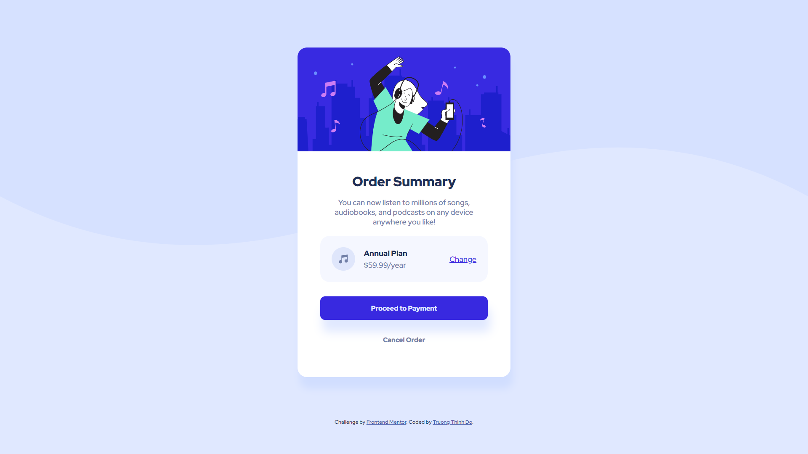

# Frontend Mentor - Order summary card solution

This is a solution to the [Order summary card challenge on Frontend Mentor](https://www.frontendmentor.io/challenges/order-summary-component-QlPmajDUj). Frontend Mentor challenges help you improve your coding skills by building realistic projects. 

## Table of contents

- [Overview](#overview)
  - [The challenge](#the-challenge)
  - [Screenshot](#screenshot)
  - [Links](#links)
- [My process](#my-process)
  - [Built with](#built-with)
  - [What I learned](#what-i-learned)
  - [Continued development](#continued-development)
  - [Useful resources](#useful-resources)
- [Author](#author)

## Overview

### The challenge

Users should be able to:

- See hover states for interactive elements

### Screenshot



### Links

- Solution URL: [Add solution URL here](https://your-solution-url.com)
- Live Site URL: https://lonelyknight2902.github.io/Order-summary-component/

## My process

### Built with

- HTML5
- CSS
- Flexbox

### What I learned

Throughout this project, I have been able to apply my knowledge on HTML, CSS, flexbox and improve my visual skills by looking at the given design and understanding how to get that look with HTML and CSS.

Here's mostly what I learned by styling the card class:

```css
.card {
  width: 327px;
  height: 567px;
  margin: 70px auto;
  margin-bottom: 60px;
  background-color: white;
  display: flex;
  flex-direction: column;
  align-items: center;
  border-radius: 20px;
  overflow: hidden;
  box-shadow: 5px 25px 15px hsl(223, 100%, 91%);
}
```


### Continued development

In the future, I want to continue to perfect my CSS skills and move on to React as well as exploring to the backend and other technologies. My top priority would be creating my personal website and a website for touring my former high school (due to the COVID-19 pandemic, new students still haven't gotten the chance to tour our beloved school).

### Useful resources

- [Interneting is hard](https://www.internetingishard.com) - This beginner-friendly website for web development provides useful knowledge and great visualization which helped me understand the basic concept of HTML and CSS with ease.

## Author

- Github - [lonelyknight2902](https://github.com/lonelyknight2902)
- Frontend Mentor - [@lonelyknight2902](https://www.frontendmentor.io/profile/lonelyknight2902)
- Linkedin - [Trường Thịnh Đỗ](www.linkedin.com/in/trường-thịnh-đỗ-418616209)
